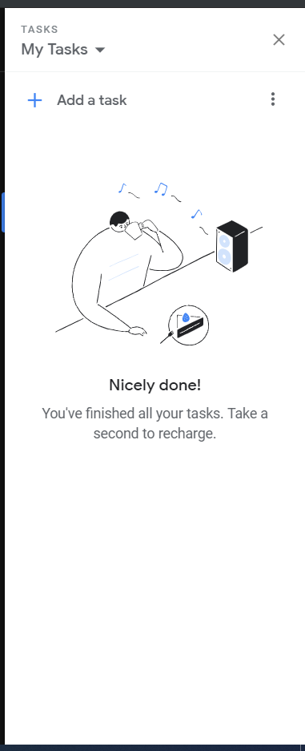

# Google Tasks Redesign

## Preface
About 5 months ago I discovered the Google tasks app. I am a massive fan of the new style they are going for and wanted to use it as my todo app for a while. However there were a few issues I had with it such as the lack of reoccurring events. However more pressingly there was no desktop app. I am someone who works constantly on a desktop or laptop and I do not typically like to have my phone with me when working, furthermore I do not like distractions thus the mixed application style Google has started making with tasks off to one side and gmail or Google calendar in focus does not work for me. So the lack of a way to access google tasks independently of anything else was the last nail in the coffin. Which is a real shame because this app looks beautiful.

## Problem
I really love the phone app, it is beautiful, incredably nice to use, and I could gush about it for years. I decided to make this application as though I worked at Google. There already exists [at least one](https://github.com/KarafiziArtur/react-google-tasks) webapp interface for Google tasks however it does not follow material 2.0 design system.

## Goals & Solution
My primary goals for this project are to buff my portfolio, and learn. This is a relatively large endevor due to the fact that I have very little time to work on this so the timeframe is undefined however by the end of it I want to have a fully functional desktop alternative to Google tasks that feels like Google could have made it.

## Discovery
On loading the app (viewed from gmail) you are greeted with this:

I am going to go ahead and assume that the lack of any greeting was due to the my previous expirements with this app. This shows a nice illustration with very clear actions a user could take:

* add a task
* close the sidebar (this is still gmail)
* show a dropdown of the all lists a user has.
* get more options.

This is incredibly simple by design.

Adding a task does a little animation to transition from wide sholdered cake man to a functional application. A simple text box in which to add a task is shown with the hallmarks of a "task item" such as the unchecked circle and editing menu button.

Upon clicking this button you are taken to this page that shows all the options you are given to provide more context to your task. Once again I note the simplicity of this design. Nothing is too overbearing, just 2 simple text fields, a dropdown, date picker, and a way of creating subtasks.

When creating a subtask the "task item" ui theme is kept consistent.

This is the same component with a few noticeable changes: 
* there is no edit menu
* there is a helpful little arrow
* there are two small breaks in the circle at lower resolutions
    I am not sure if this is intentional or simply a rendering glitch as it only shows when my monitor is in 1080p. I am going to treat it as such

When returning to the main menu the subtask is shown nested below the parent task.

When adding details to the parent task those are also shown in the task list.

When adding a date to the task that is also shown.

At this point there is quite a bit of data shown here and it is still not really overwhelming and easily scanable. But this is about it for this app. This is the meat of what it does. There are several other features such as keyboard shortcuts that improve the poweruser's expirence. However this is really most of it.